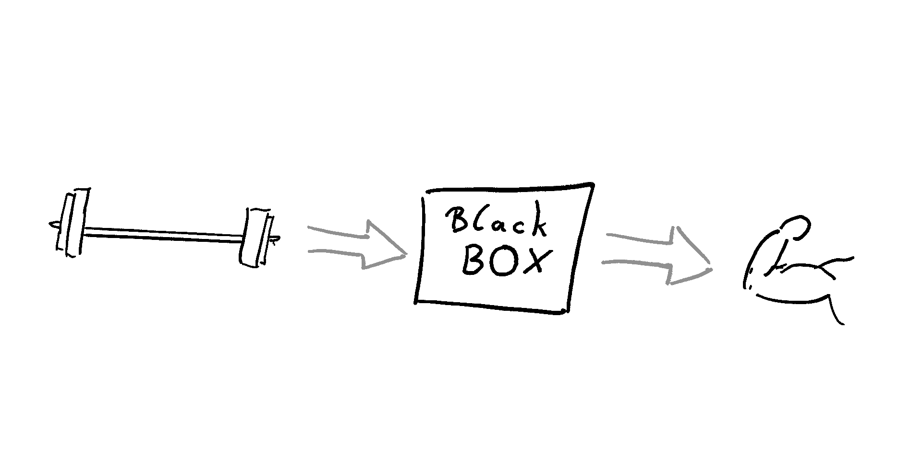
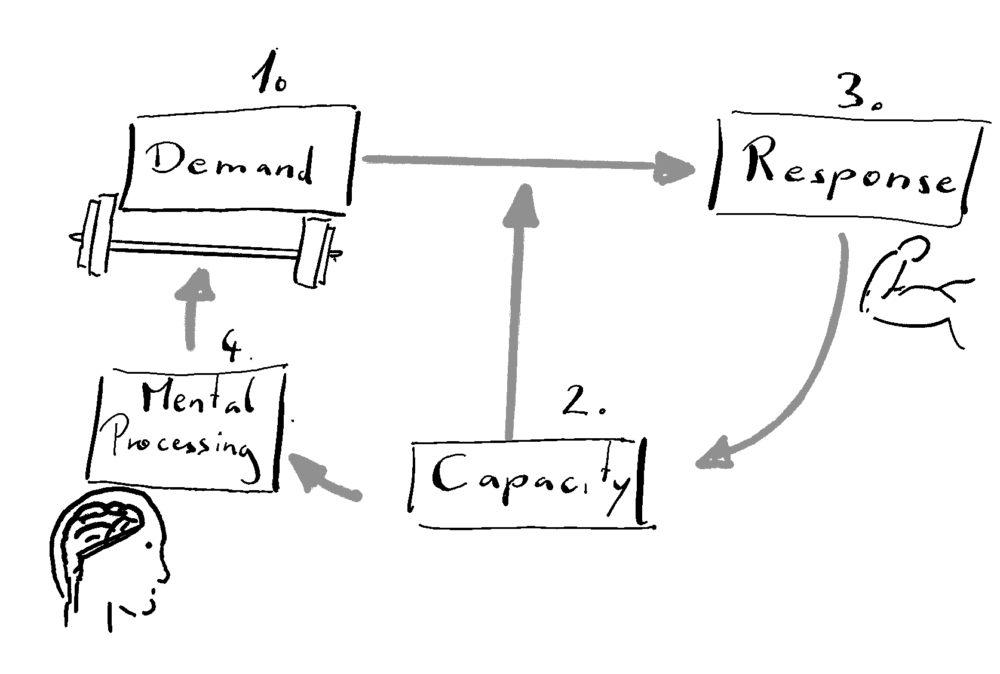

# ---
# title: "A discussion of Training"
# author: "Peter Raidl"
# date: "2024-10-01"
# categories: [blog, science, training, exercise, concept]
#image: "Training.png"
#---

<!--# 
* Textbook definition of training
* Comparison to Learning
* Where does our understanding come from -> bio medical literature
* Direct link to stress research
* Older historical ideas about training

-->
Most of my extensive (formal and informal) education falls into the realm of training science. So I want to start right there and give you a introduction to what I mean with *training*.

# What is Training {#sec-training}

When referring to training, I talk about to a *process* that is specifically designed to improve, rebuild or stabilize some human **capacity**, **biological function** or **structure**. Breaking down this working definition, I want to emphasize the term *process*.
This means that training can not be defined without inferring to changes over time. Further, a process does involve multiple components of which none is a sufficient substitute the whole. The components of training might be defined in different ways. I want to create a very simple model (A) and a second model that is a little more sophisticated (B). Keep in mind, that the simple model A implicitly comprises many presuppositions. This is still true for model B. Only that model B is easier revealed as being false.

::: {#fig-TPmodels layout-ncol=2}

{#fig-modelA}

{#fig-modelB}

Working Model for Training Processes
:::

Model @fig-modelA shows a classical example of a black box. Training can simply be viewed as a input-output function. The input represents the demand we put on the organism and the output the adaptations that happen. There is some undefined (or undefinable) black "magic" happening in the middle, transforming adaptations from demands. This might sound like a vague model but it has the advantage of being hard to falsify. Every model of higher granularity also includes more potential breaking points.
Model @fig-modelB depicts the different components of the training process. Here I would generalize them as (1) demand to the organism, (2) capacity of the organism at the given situation, (3) response of the system, (4) mental processing and controlling. These four components stand in a circular relationship with each other.

The mental processing (4) (@fig-modelB) may need further explanation.
While most of what we see in training happens between nodes (1), (2) and (3), the mental model makes it a training process.

**We call it training if the intention is a systematic link between demand, capacity and adaptive response.**

The mental processing as a systemic link represents planning, observing and reorganizing the three other nodes. 

## Measuring a Process

The training *process* can not be operationalized by just looking at one component. Training is represented as the link function of all those points. So it can not be described as a single event in time and this makes it very hard to measure. For the most part only the input (the demand) and the output (the adaptations) can be quantified.

## Three sights of adaptations:

Within the process I listed three potential sights of adaptation: Biological capacities, function, and structures. An example of a **capacity** would be the ability to run a marathon or go to the toilet without help. But it could also be the ability to read or write faster or hold ones attention on the breath. With **biological function** I very broadly refer to the ability of changing internal states that can be measured[^whatstraining-1]. A typical example could be the control of heart rate during running or the to control blood glucose levels during different situations. Lastly, **biological structure** ended up with a separate category. Here I refer to preferable changes in tissue size, architecture or structure like increased muscle volume or number of red blood cells. So training is always goal oriented in this definition. There is a motivation and a reason to structure ones actions to reach the defined goals. This is more or less a textbook definition of training [@hohmannEinfuehrungTrainingswissenschaft2020]. What is fundamental to me here is, that training is only possible if someone has a conscious, explicit idea of what to work on and how to achieve this. So, there is no such thing as training by chance. Also adaptions to physical activity that are not lead by a systematic approach to reach a goal are not considered training. We can now compare training to a very similar process. **Learning** can unconscious. It can happen out of internal or external demands to the system/organism not just out of long term planning. Changes occurring by learning should be differentiated from developmental or fatigue-induced adaptations. Obviously, learning can also be pre-contemplated and goal oriented just like training. The difference might be that learning involves long term changes in behaviors or expressing completely new behaviors. Training is sometimes thought of a process that can only be done after a pattern already emerges e.i. was already learned. But this is not a strict rule and maybe we could also define training as a subcategory of learning.

[^whatstraining-1]: This does not mean that we have to measure it during the training process. But it sould be measurable in principle. For example we could measure the transport of oxygen to a target tissue in the lab. But we will not do that for every intervention we plan for every person undergoing the training intervention.

The funny thing about the difference between training and learning is, that the predetermined goal that is inherent of training, does not have to be concussion to the organism performing the training. A rat or a pigeon could also be trained without it understanding the training process. Actually, before physiological adaptation, ATP, lactate and VO2max was popular, training principles were also heavily influenced by psychology during a time when behaviorism was the proper way to frame human learning[^whatstraining-2] [@krugerTrainingTheoryWhy2006]. Training principles on how to train a human (or a rat, as the most influential scientists of that time didn't see much of a difference) were radically different from the today's viewpoint. A person could be trained by different forms of conditioning without the person being aware of the process. The scientist or coach could play god in this scenario and transform the person into whatever they like[^whatstraining-3]. Still, somebody has to be aware of the training process. A religious person believing in a *greater plan* that unfolds might call any learning process also training. But for the rest of us there is a difference. Another problem in the definition of training is, that as a *process* it is very hard to grap a hold of it and actually measure training. We are only able to track the outcomes of training, but not the process itself. Typically, we only measure the thing we previously specified as important. Surely, there are more general was to measure ANY changes in the categories previously defined as capacities, functions and structures. But this data-mining approach to tracking, that often comes up naturally in practitioners, can actually not fall under the umbrella of training induced changes if we did not specify a goal beforehand. One could even argue that cross-training effects are a complete misnomer. If you train to get stronger in lifting weights and after a couple of weeks you realize you have become a better runner this can not be a training effect by most textbooks definitions. The definition of training seems to be very much in line with the Popperian view on science. It is a deductive process with predefined hypothesis. Clearly we do not handle it like that and mix it up with inductive methods of observing post-hoc what happened to reason the effects of the training process. I think this is actually a good thing. Certainly, historically we mostly understood training principles from a inductive perspective. We built our ideas on how to train by observing changes time and time again.

[^whatstraining-2]: Especially in the USA. In Europe *Gestalt Psychology* and other phenomenological approaches were more prominent.

[^whatstraining-3]: Watson famously claimed to be able to make anything out of a healthy infant

<!--# In training science, we look at biomarkers and performance metrics while psychological components are part of the variance we sometimes call error in statistics.  -->

Training, as view view it today is heavily influenceed by physiology and a biomedical framework. The most commonly refered model to describe adaptations to a training is the **Fitness-Fatigue Model** (FFm) by Bannister [@chiuFitnessFatigueModelRevisited2003]. It is a direct descendent of the **General Adaptation Syndrome** (GAS) by Hans Selye [@selyeStressDistress1976]. The GAS describes the typical stress response. So in exercise science training is always viewed from the perspective of stress. A stimulus has to disrupt the homeostasis[^whatstraining-4] to force the organism to adapt. Repeated exposure to a stimulus that is strong enough to disrupt hoemeostasis leads to the desired results. The FFm works very well in most physical training situations and can be understood intuitively. The notion that a disruption of some kind of homeostasis is necessary for adaptations can be challenged. Homeostasis was introduced by Walter Cannon in the 19th century as a more refined version of Bernard's *milieu interieur*. Homeostasis describes how systems/organisms self-organize to reach a stable condition like blood glucose levels or blood pressure [@cannonORGANIZATIONPHYSIOLOGICALHOMEOSTASIS1929, @cooperClaudeBernardWalter2008]. The wording I used here immediately makes clear that also Norbert Wiener with his take on self-organizing systems by feedback (*cybernetics*) was inspired by this lineage of thinking. Bringing this together I want to try to bring the concept of training also in line with the more modern concept of complex systems theory.

[^whatstraining-4]: Let me come back to that.

Training also always follows a structure.

# Our historic and current knowledge of training {#sec-knowledge}
