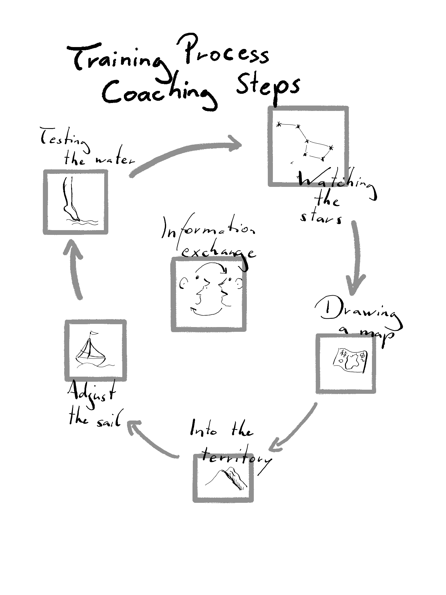

# Is AI writing your exercise program?

At the beginning of each semester, I ask students what they expect learning in the seminar *Training Processes* that I teach at the University of Vienna. The answer I hear most often is that they want to be able to write a good exercise program. At that point in their education, they have already learned the foundations of exercise physiology, biomechanics, and training science. They know the basic training principles, prioritization structures, and recommendations for a specific adaptation. Nevertheless, they do not feel competent writing a training plan for athletes.

Then, we let LLMs write an exercise program for their hypothetical athlete, and they reflect on the output. Can your favorite large language model plan your training for \*pick *your goal and athlete\**? The simple answer to that is yes! For many people and common goals, AI is doing a great job writing a training structure. It is doing a better job than 80% of human coaches. Sure, there are concerns with this approach. The LLMs do not really "know" training science. They predict words based on their training data, which can sometimes lead to serious hallucinations. They have problems with numbers, and simple repetition recommendations are occasionally off. Otherwise, LLMs are doing great.

But this shouldn't even surprise us! There is so much information on the internet about how to run a marathon or train for a bigger bench press. Even before AI and social media, writing a basic exercise program was relatively easy- especially for beginners or some specific populations. You could open any book on training and find a good structure. So don't be surprised if AI is as good as your next best coach!

Interestingly, the students can easily fact-check the AI. They can immediately see the major issues with the outlined training structure and correct them. But it is also a mindboggling experience. They want to learn something that the current LLMs already can do well[^1].

[^1]: The second learning is that they also already understand what good programs look like. That is a surprise to them.

## But is AI a good coach?

From a coaching perspective, I differentiate the training process into five phases. Each phase has its purpose and order. Naturally, this is just a rough guideline. The order is not fixed, and an experienced coach often jumps between phases. Writing the exercise program is just a tiny part of the process, which I call "drawing the map". If you have a map, you are ahead of the game - But only if you have a clear destination, know what you are capable of, and can navigate and adjust if the road is blocked.

{width="300"}

Therefore, the more interesting question is, can AI do all that? The only way training can work out long-term is when regular adjustments happen according to the physiological and psychological needs of the person in relation to the goals and environmental constraints given. I am definitely not saying that AI can not do that. But this is the *Training Science Turing Test* we should think about. It is not interesting if it can write down 10 exercises in the correct order and the right repetition zones according to all the books published about training.
