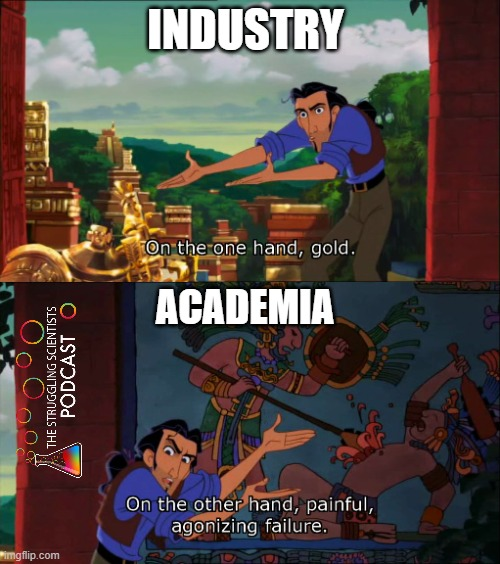

# Double Commitment - Life Outside the Ivory Tower

As I have written on the front page, science and scholarship are activities of leisure. However, scientists must also live on something. Many of the known scientists of the past lived from family wealth. They did the experiments and observations out of curiosity, leisure, fame, glory, or to serve god. Nowadays, things are different. While academic researchers do enjoy prestige in some respects, the financial rewards are relatively limited. This is especially true concerning extensive education, high working hours, and the low probability of reaching the top of the food chain, which mostly means securing tenure. For many, an alternative route is entering the industry. This is a more realistic route for some research areas than others and nearly impossible for some.

{width="250"}

Sometimes, there is some middle ground. Some scientists hit the "jackpot" and do both. They enjoy the freedom of academia and, as a related sideshow, they work in the private sector. For health and performance-related fields (the ones that I am most interested in) like sports and exercise science, psychology, and nutrition, this might involve giving seminars, selling books, working with supplement companies, or leveraging one's research ideas into other profitable products.

This is more common than one might think. Probably, some big names come to your mind that do exactly that. So, in essence, they are selling the expertise they have carved out over years or decades of work. Fair thing, right? Let me make this clear: Some independent scientists directly use the leverage they gain to fund their research with good intentions. Some claim that their breakthroughs would not have been possible in the *traditional way* because nobody believed in their work and they couldn't get funding.

Researchers are faulty human beings. Regardless of whether they are funded by a national funding agency or their own company - driven by personal beliefs and the urge to be right. We are invested in our ideas and hypotheses. I do not know if **everybody** is, but I certainly am[^1]. I do not believe that being invested in an idea is completely avoidable. But caution is advisable if scientists sell products (or knowledge) related to their research. It might sound like a good thing if popular Stanford professors claim that their podcast is independent of their role as researchers, but I am not convinced that can be true. Not only because they (probably) have no chance, but being the same person!

[^1]: and if there is one thing I learned from stats, it's that, most likely, I am a typical person and others think and act similarly.

Sure, "*research is me-search*" and personal investment might come with higher motivation, drive and creativity. This makes the objective work vulnerable and contaminates your role as a researcher. Another profession has known about that for hundreds of years. That might be why, in many traditions, priests are not allowed to have a family or sex. That's how they stay independent and hard to bribe (in theory).

## But Why is Selling Books Bad?

Making research available to the public is a significant component of modern science and is incentivized and with good reason. We want educated and responsible citizens!

**BUT WHY SELL IT???** That's the whole point.

We want people - all people - to get access to the knowledge base. We are dissatisfied with the influence of large publishing houses. However, it is hard to change that in the case of peer-reviewed articles without risking one's career. We talk about the [FAIR](https://www.go-fair.org/fair-principles/) principles within the ivory tower of science. But why not expand these principles beyond that?

We can and should leverage all those problems into **unrestricted publications**, such as blogs or **free** online books.

**Publish your teaching openly:** I myself started putting one of my undergraduate seminars into written form and publishing it on Bookdown[^2]. This makes my seminar not only more transparent for students but also allows the information to be updated on a regular basis. Even after finishing the course, students can easily access the information. One could argue that you no longer need to attend the seminar, as all the information is accessible for free on the internet. But in my opinion, that is the case anyway. I can not tell our students any exercise training secrets anyway. Nobody should go to university for that explicit, teachable information anymore. We passed that point a long time ago! The good news is that we can focus on experimental learning and carve out competencies[^3]!

[^2]: It is in German and addresses bachelor sports and human movement science students. It is work growing and work in progress. But you can find it [here](https://bookdown.org/peter_raidl/personalcoaching_script) if you are interested in exercise related Personal Coaching.

[^3]: Higher levels of Bloom's taxonomy of knowledge: apply, analyze, evaluate, and create [@krathwohlRevisionBloomTaxonomy2002]

**Writing blog posts about your research:** Traditional scientific journal articles can only withstand so much information. The general consensus in many fields is not to spoil the reader with too much personal experience, different challenges during various phases of the project. I think even in pre-prints and other publishing formats that are more researcher-centered, we hold on to the traditional writing style, like using passive voice as if everything was executed by an emotionless and error-free research robot. In reality, there is often some kind of thinking, tweaking, rethinking, and frustration involved. Sharing those things might improve project science. Writing those protocols in a personal way might not only help you resolve some of the project-related issues but also make the work of the grad student working on a similar project at another university easier. *Humanizing* our daily work by writing about it is also a way to make science and scientists more relatable for people outside of academia. We have a huge problem of trust in science. Simply informing people on "how reality works" does not do the trick to improve that. Playing with open cards might!

But being relatable is also something we should work for within *Team Science*. Seeing that all science (not only my project) is messy. There are struggles that go beyond low statistical power and deadlines. I personally would love to see more unrestricted writing from scientists. I would love to see less profit-oriented side gigs and more real content - raw, personal, and messy
