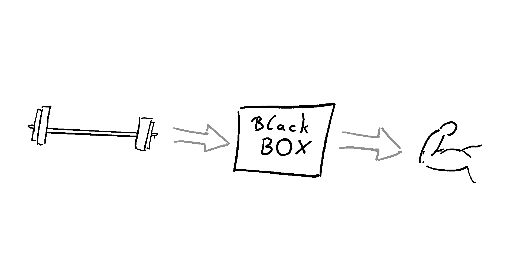
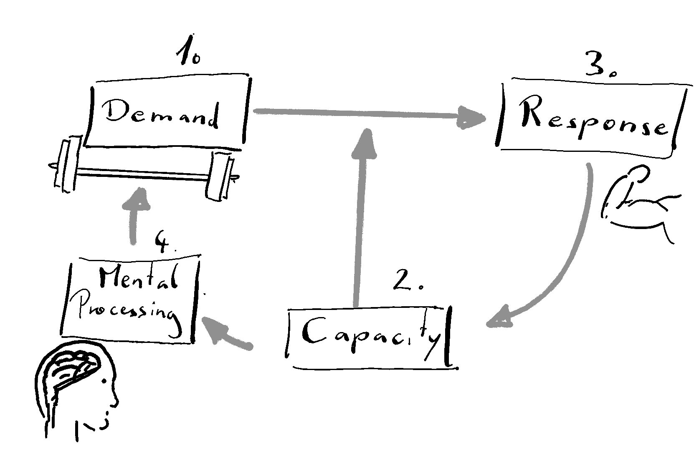

Most of my (formal and informal) education falls into the realm of training science. So, I want to start right there and give an introduction to what I mean by *training*. In this blog post, I wrestle with the concept of training, learning, practice, and development. This is not my final thought on this topic. Don't be surprised to end up with more questions than answers after reading it. Good food for thought has to get chewed on - a lot.

# What is Training {#sec-what-is-training}

Training is a *process* that is designed to improve, rebuild, or stabilize specific human **capacities**, **biological functions,** or **structures**. Let's break that down and look at each element of my working definition. Seeing training as a process means that change over time is at the center, not certain static states. Nothing we observe at a single timepoint can tell us that what we observe is training. A process can be described with multiple components. But none of them alone is a sufficient substitute for the whole. I have created a very simple model (A) and a second model that is a bit more detailed (B). The simple model A implicitly comprises many aspects that are in model B, which also comprises a multitude of aspects. The question is which level of abstraction is more useful and robust.

{#fig-TPmodels layout-ncol="2"} {#fig-modelA}

{#fig-modelB}

Working Model for Training Processes

Model @fig-modelA shows a black box. Training can be viewed as a simple input-output function. The input represents the demand put on the organism and the output the elicited adaptations. There is some *magic* happening in the middle, transforming the input to the output. This comprises unknown and, by the model, *undefinable* mechanisms. Model A might seem vague, but it is robust. Every model of higher granularity also includes more potential breaking points. It's also helpful to free the user of the model from mechanistic explanations. Committing to the model leaves room for "what works" - pure empirical evidence. It also does not need any additional qualifiers that are more philosophical. Is training structure planned, goal-oriented? Does it need a conscious agent? None of that matters to understand the interaction of demand and adaptation. Model @fig-modelB depicts different components of the training process. I generalize them as (1) demand to the organism, (2) current capacity of the organism, (3) response of the organism, and (4) higher-order processing and control. These four components exist in a network-type relationship. The higher-order processing (4) (@fig-modelB) may need further explanation. Most biology happens between nodes (1), (2), and (3), with control and processing happening on different levels (lower/faster and higher/slower), parallel and serial through the connections. But the training process needs additional, explicit mental processing. This is important to distinguish training from other types of adaptational processes. Including high-order processing is a definitional truth only. But it is necessary.

::: callout-note Training needs an intention that links demand, capacity, and adaptive response to a goal.

The (higher-order) mental processing is the link. It manifests as cyclical explanation, prediction, and observation of adaptive responses, as well as planning and reorganizing the demands. :::

Training is represented as the link function of all nodes. It is hard to measure a process. Only the input (the demand) and the output (the adaptations) can be quantified effectively. The parameters that are traditionally used to describe the demand are intensity, volume, frequency, density, and intent. Combined with the physiological adaptations, they serve as the basis for quantifying training - but only in their relation!

## Three sites of adaptations:

It is helpful to categorize adaptations. This helps in forming theory, explanations, and predictions, which are necessary for higher-order processing and control. I differentiate three levels of adaptation: Biological capacities, function, and structures. An example of a **capacity** is the ability to run a marathon or carry groceries. Other examples are improved reading or writing speed or the ability to keep attention on the breath. Capacities manifest as the observable and meaningful outcomes and can, in theory, be explained by function and structure. The downside is that capacities are never directly measurable. The expression of capacities as performance depends on the environment, task, and other personal factors. As an example, you cannot know your "true" aerobic endurance capacity because it depends on the event, the temperature, your motivation, food intake, and a million other aspects. Similar arguments might be made for the other levels of adaptation, but it is most dominant for capacity. The second level, **biological function**, refers to the ability to change internal states. Good examples are changes in heart rate or blood glucose levels during different demanding situations. In general, function is observable as *energy flux*. This is a more direct operationalization than capacity but less meaningful in relation to performance and goal-directed behavior. The third, and most fundamental level, adaptations in **biological structures**. These are changes in tissue size, organization, or molecular composition, like increased muscle volume, number of red blood cells, or changes in collagen types. Major chronic changes in biological structure are often slow or require repeated, high demands relative to capacity. At the same time, transient micro changes to biological structure are always happening and are the basis for adaptations in function and capacity. In summary, adaptations to capacities are often the aim of a training process. They are not directly measurable, and meaningful changes can take place within seconds. From the individual's perspective, capacities are determined by function and structure. Biological function can be described as the ability to transform energy. In contrast to capacity, function is directly observable as the rate of change. Structure is the most fundamental aspect. It is the time-invariant state of the biological system. While it can change rapidly, on a macro level, structure is relatively stable. Training is goal-oriented. The goal can be defined on any level of adaptation. What is then needed is a mechanistic reason or explanation that links the demands to the intended adaptations. If training is always goal-oriented, as standard in contemporary textbooks, someone MUST have a conscious, explicit explanation and prediction model of what works. This means that there is no "training by chance". Adaptations to physical activity that are not led by goal-oriented reasoning cannot be considered training. They are something else. This even makes the word *cross-training effects* a misnomer. If you train to get stronger in lifting weights and after a couple of weeks you realize you have become a better runner, this cannot be a training effect.

## Training vs Learning and Development

Learning is a very similar process of long-term adaptations. As with training, learning happens through the interplay of environmental demands and the person. For learning, only changes that occur within the person are relevant (not of the task or the environment). Besides the similarities, the two distinctions between learning and training are (1) the need for prior experience and (2) the goal-orientation and long-term planning in training. (1) Learning does not need prior experience. If you cannot ride a snowboard yet and you start sliding (and falling) down a hill, you are learning. When you start following a scheduled structure to improve your snowboarding skills, you are training. At first, this sounds like a bulletproof difference. However, it's hard to see where prior experience comes into play and where learning ends and training starts. (2) Learning and training differ in the need for higher-order processing (model B). Learning does not necessarily include a conscious plan. You can learn for an exam (goal-oriented and structured), but you can also unconsciously learn to avoid social gatherings (not goal-oriented, unstructured). In this scenario, learning can even happen within a very short timeframe. Sometimes it only needs one exposure to permanently learn something. Training never happens within one session. It always needs regular exposure to demands over a longer period. There is another difference that might come to mind. Learning could be defined as adaptations that solely happen in the central nervous system (CNS). I don't think this is a helpful distinction when it comes to the whole organism. When learning to walk or to play the piano, adaptations will span throughout other systems, especially the musculoskeletal. Motor performance is not entirely regulated by the CNS but includes self-organizing properties of muscles. Further, efficient walking does need certain bone configurations and architecture of the foot. These are not automatic, developmental changes (see below) but only happen through practicing walking. Transient adaptations are typically not considered learning. This is something that bites many coaches when they confuse improvements during a session with long-term learning. In reality, these two live in an orthogonal space ([see here](https://paeddasan.github.io/PersonalCoaching_Script/11-MotorLearning.html)). Development is a close relative of learning. It happens independently of environmental demands. As long as the right prerequisites are given, development happens automatically. It often follows a non-linear timeline. Within a person, learning and development are indistinguishable. This gives rise to misinterpretations and false attributions. For example, some young athletes are called talents but are just further in their development. They later end up being merely average after the others catch up. Other times, coaches falsely earn credit for improving capacities while developmental spurts occur. This is similar to a medical intervention, whose effects cannot be distinguished from the normal "development" of the pathology. Coaches and teachers must be aware of this trap and read developmental patterns in their trainees as well as possible. Otherwise, wrong interventions will lead to wrong conclusions, and performance will stagnate, or trainees will drop out or get injured. In summary, learning involves long-term changes in behaviors or expressing completely new behaviors independent of goal-orientation. Training is a process of improving already existing patterns. The pattern of behavior was already learned. So maybe training should be defined as a subcategory of learning. One more caveat to the difference between training and learning is based on higher-order processing. The predetermined goal that is inherent in training does not have to be "known" to the organism performing the training. A rat or a pigeon can be trained without it understanding the training process. The animal is then learning, but the person who is the teacher is training it. Before physiological adaptation was the popular underpinning of related scientific fields, training principles were influenced by psychology. During that time, behaviorism was the proper way to frame human learning [^1] [@krugerTrainingTheoryWhy2006]. Training principles for a human (or a rat, as the most influential scientists of that time didn't see much of a difference) were radically different from today's viewpoint. A person could be trained by "conditioning" without the person being aware of it. Consciousness was not important for that framework. The scientist would play god and transform the person/animal into "whatever they like"[^2]. Somebody still has to be aware, but not necessarily the trainee. A religious person believing in a *greater plan* that unfolds might call any learning process also training. But for the rest of us, there is a difference.

[^1]: Especially in the USA. In Europe *Gestalt Psychology* and other phenomenological approaches were more prominent.

[^2]: Watson famously claimed to be able to make anything out of a healthy infant.

While training focuses on the planning and structuring of goal-directed behavior, learning focuses on the adaptations that happen.

## Practice

Writing this, I realized that I missed out on the concept of practice, which is funny as I like this word a lot (link blog post to practice). In sports, art, and music, as well as in spirituality, *practice* is quite often used to describe regular behavior. What makes it different from training is the focus on the skill component or the functional capacity (highest level of adaptations) and, with it, neurocentered adaptations. It's in the realm of structured and goal-oriented learning. But it can also mean something different. A practice can also be something that is indifferent to goal-orientation and improvement. It can have an athletic component and give meaning through the behavior itself. This is a definition that can be found in spirituality but can certainly be adopted for other kinds of behavior. Physical practices can have their meaning in the act of doing them.

We saw training as the planning and structuring, learning as the behavioral adaptations, and practice as the repeated behavior itself.

## Measure and manage

This all leads us back to the problem of tracking expected and unexpected changes in capacity, function, and structure. Typically, we only measure the outcome we previously specified as important. There are more general ways to measure any changes in the categories previously defined. This data-mining approach to tracking changes seems to come up naturally in practitioners. But these changes are not training-induced changes for reasons outlined above. The definition of training seems to be very much in line with a deductive, hypothesis-driven way of doing science. In practice, we do not handle it like that and mix it up with inductive methods and post hoc reasoning. I think this is actually a good thing. Historically, training principles can be understood from an inductive perspective. We built our ideas on how to train by observing changes time and time again. This blog post ended up as a struggle. I realized that many of the conventions about what training ought to be don't hold up against how we use the word as practitioners. There is also no hard wall between learning, practice, and training. To progress our understanding of guided adaptations that improve health and performance, we should keep wrestling with these concepts until we understand their meaning, how to observe them, and how to induce them.
